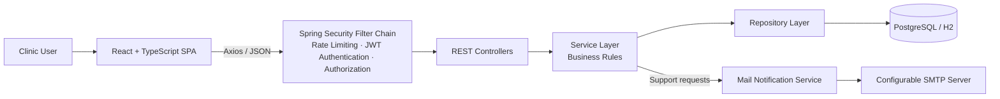

# Veterinary Clinic Management System

A full-stack application for managing the daily operations of a small veterinary clinic — owners, pets, veterinarians, appointments, vaccinations, and invoices — built on a React/TypeScript single-page frontend and a Spring Boot REST backend with JWT authentication and role-based authorization.


## Project status

This project is under active development. The core backend and frontend modules are being implemented and integrated according to a shared API contract. This README describes the intended, completed system; configuration, deployment, and integration details may evolve as development continues.

## Table of contents

- [Project overview](#project-overview)
- [Key features](#key-features)
- [Team and contributions](#team-and-contributions)
- [Roles and permissions](#roles-and-permissions)
- [Business rules](#business-rules)
- [Technology stack](#technology-stack)
- [Architecture](#architecture)
- [Repository structure](#repository-structure)
- [Prerequisites](#prerequisites)
- [H2 quick start](#h2-quick-start)
- [PostgreSQL setup](#postgresql-setup)
- [Frontend setup](#frontend-setup)
- [Running the complete application](#running-the-complete-application)
- [Environment variables](#environment-variables)
- [Demo accounts](#demo-accounts)
- [API documentation](#api-documentation)
- [Security](#security)
- [Testing](#testing)
- [Additional documentation](#additional-documentation)
- [Contributing](#contributing)
- [License](#license)

## Project overview

A clinic's day runs on a handful of interlinked records: an **owner** brings in a **pet**, a **veterinarian** examines it during a scheduled **appointment (visit)**, the visit produces diagnosis and treatment notes, vaccination records, and weight history, and eventually an **invoice**. This system digitizes that workflow for a small clinic — built around a persona of one receptionist and two veterinarians — so that staff can manage owners and pets, schedule and track appointments, record vaccinations and follow-ups, and issue invoices from a single application instead of paper records or spreadsheets.

The application supports three operational roles — **Administrator**, **Veterinarian**, and **Receptionist** — each scoped to the data and actions relevant to their job. A dashboard summarizes appointment, revenue, and vaccination activity across the clinic, and a global search and notification feed surface recent and upcoming activity.

## Key features

**Authentication and authorization**
- Email/password authentication issuing a JWT, used as a bearer token on every subsequent request.
- Protected frontend routes that redirect unauthenticated users to the login page.
- Role-based backend authorization enforced independently of the frontend.
- Rate limiting on authentication endpoints to slow down brute-force login attempts.
- Administrator-managed password reset (no self-service "forgot password" flow).

**Owner and pet management**
- Owner records with search and pagination, including a detail view of an owner's pets and invoices.
- Pet profiles capturing species, breed, sex, birth date, allergies, and chronic conditions.
- Pet archive/activation lifecycle in place of destructive deletion.
- Automatic identification of inactive patients — pets with no visit in the last two years.
- Weight history per pet, with new weight records added at check-in or during a visit.

**Appointment and clinical workflow**
- Appointment calendar with creation, rescheduling, and vet assignment.
- Visit-status workflow (scheduled, checked in, in examination, completed, or cancelled).
- Overlap protection so a veterinarian cannot be double-booked within the same time window.
- Diagnosis and treatment notes, entered during examination.
- Allergy and drug conflict warnings surfaced when treatment notes reference a substance the pet is recorded as allergic to.
- Follow-up visit creation from a completed visit's follow-up date.

**Vaccination management**
- Vaccination history and dose tracking per pet.
- Backend-calculated next-due dates based on vaccine type.
- Dashboard alerts for upcoming and overdue vaccinations.

**Invoice management**
- Invoice creation with categorized line items (consultation, vaccination, surgery, hospital, other).
- Backend-calculated subtotal, VAT, and total.
- Invoice status and payment tracking (draft, sent, paid).

**Dashboard and analytics**
- Daily appointment summary and active-patient metrics.
- Vaccination and unpaid-invoice indicators.
- Revenue summaries, appointment trends, and cumulative year-to-date activity.
- Per-veterinarian workload and performance reporting.
- Today's schedule overview alongside upcoming vaccination and follow-up alerts.

**Search, notifications, and support**
- Global search across owners, pets, and visits.
- An application notification feed for upcoming appointments, vaccinations due, and recently created records.
- An internal support-request module: any authenticated user can file a request, and administrators triage and resolve it.
- A best-effort notification through a configurable SMTP server when a support request is created; a notification failure does not affect the successfully stored request.

## Team and contributions

This is a two-person, full-stack collaborative project, developed against a shared API contract ([`backend/docs/api-contract.md`](backend/docs/api-contract.md)) and integrated into a single application.

| Contributor | Role | Primary responsibilities |
|---|---|---|
| [Efe Adak](https://github.com/EfeAdak) | Backend Developer | Java/Spring Boot backend, REST API, database model, security, authentication, authorization, business rules, validation, exception handling, and backend testing |
| [Rümeysa Nur Ceyhan](https://github.com/nurrumys) | Frontend Developer | React/TypeScript frontend, pages, components, forms, routing, state management, charts, responsive interface, and API integration |

This division reflects each contributor's primary area of ownership within a collaborative effort — it does not imply that either contributor built the application in isolation.

## Roles and permissions

Access is scoped by role. Some capabilities are further split between *creating or rescheduling* a record, *updating its operational status*, and *editing its clinical content* — these are distinct permissions rather than a single "can touch this resource" flag.

| Capability | ADMIN | VET | RECEPTIONIST |
|---|---|---|---|
| Owner records — create, update | ✅ | View only | ✅ |
| Owner deletion (only if the owner has no pets) | ✅ | ❌ | ❌ |
| Pet records — create, update | ✅ | View only | ✅ |
| Pet archive / activate | ✅ | ❌ | ✅ |
| Pet weight record entry | ✅ | ✅ | ✅ |
| Appointment creation and rescheduling | ✅ | ❌ | ✅ |
| Appointment status updates (check-in, in-exam, complete, cancel) | ✅ | ✅ | ✅ |
| Diagnosis and treatment notes | ✅ | ✅ | ❌ |
| Follow-up visit creation | ✅ | ✅ | ❌ |
| Vaccination create / update | ✅ | ✅ | ❌ |
| Vaccination delete | ✅ | ❌ | ❌ |
| Invoice creation and status updates | ✅ | View only | ✅ |
| Veterinarian management and performance reports | ✅ | ❌ | ❌ |
| User registration and administrator password reset | ✅ | ❌ | ❌ |
| Support requests — create, view own | ✅ | ✅ | ✅ |
| Support request triage (any request) | ✅ | ❌ | ❌ |

A veterinarian's appointment access is not read-only overall: a vet cannot create or reschedule an appointment, but does move it through its status workflow and owns everything clinical — diagnosis, treatment notes, vaccinations, and follow-ups.

`ADMIN` is a system/administrative role for full-access management and seed data rather than a distinct clinic-staff persona — the source persona defines only veterinarians and a receptionist.

## Business rules

Full detail lives in [`backend/docs/business-rules.md`](backend/docs/business-rules.md). Selected highlights:

- **Appointment overlap protection** — a veterinarian cannot have two visits within 15 minutes of each other.
- **Pets are archived, never hard-deleted** — lifecycle is managed through archive/activate.
- **Owner deletion is safeguarded** — an owner with any pets (archived or active) cannot be deleted; deletion never cascades.
- **Invoice totals are backend-controlled** — subtotal, VAT, and total are always computed server-side.
- **Vaccination due dates are backend-controlled** — `nextDueDate` is calculated from vaccine type and is never accepted from the client.
- **Medical data is role-restricted** — diagnosis and treatment notes can only be entered by a veterinarian or administrator.
- **Allergy and drug conflict warnings** — a non-blocking warning is returned when treatment notes reference a substance found in the pet's recorded allergies.
- **Follow-up creation** — a completed visit with a follow-up date can generate a new scheduled visit.
- **Inactive-patient calculation** — a pet with no visit in the last two years is flagged inactive on read.

## Technology stack

### Backend

| Technology | Purpose |
|---|---|
| Java 17 | Language / runtime |
| Spring Boot 3.5.16 | Application framework |
| Spring Web | REST controllers |
| Spring Data JPA (Hibernate) | Persistence |
| Spring Security | Authentication and role-based authorization |
| Bean Validation (Jakarta) | Request DTO validation |
| JWT (jjwt) | Token issuing and verification |
| Bucket4j | Authentication-endpoint rate limiting |
| springdoc-openapi | Swagger / OpenAPI documentation |
| PostgreSQL | Primary relational database |
| H2 | Self-contained local-development and demonstration profile |
| Spring Boot Starter Mail | Support-request email notifications |
| Lombok | Boilerplate reduction |
| Maven (with Maven Wrapper) | Build tool |
| JUnit, Spring Boot Test, Spring Security Test | Backend test suite |

### Frontend

| Technology | Purpose |
|---|---|
| React | UI library |
| TypeScript | Static typing |
| Vite | Dev server and build tool |
| Tailwind CSS | Styling |
| React Router | Client-side routing |
| Axios | Centralized HTTP client for the REST API |
| TanStack React Query | Server-state data fetching and caching |
| Zustand | Authentication state store |
| React Hook Form | Form state management |
| Zod | Schema validation |
| FullCalendar | Appointment calendar view |
| Recharts | Dashboard charts |
| Lucide React | Icons |

## Architecture

- Spring Security is part of the Spring Boot application, not a separate service — every request passes through its filter chain before it can reach a controller.
- The filter chain handles rate limiting, JWT authentication, and authorization before a request is routed to a controller.
- Business rules live in the service layer; controllers stay thin and delegate to services.
- Persistence is handled exclusively through the repository layer.
- Email notifications are triggered by application services, not by controllers directly.



Public endpoints such as login still pass through the security filter chain (including rate limiting) but do not require an authenticated JWT.

## Repository structure

```text
veterinary-clinic-management-system/
├── backend/
│   ├── src/main/java/           # Spring Boot source, organized by module
│   ├── src/main/resources/      # application*.properties (PostgreSQL / H2 profiles)
│   ├── src/test/                # JUnit / Spring Boot Test suite
│   ├── docs/                    # backend-spec, api-contract, business-rules, task list
│   ├── decisions.md             # architectural decisions log
│   ├── pom.xml
│   ├── mvnw / mvnw.cmd
│   └── CLAUDE.md
├── frontend/
│   ├── src/components/          # reusable UI components, grouped by domain
│   ├── src/pages/                # route-level pages
│   ├── src/services/             # Axios API calls per module
│   ├── src/store/                 # Zustand auth store
│   ├── src/schemas/               # Zod validation schemas
│   ├── src/types/                 # TypeScript domain types
│   ├── src/routes/                # protected route guards
│   └── package.json
└── README.md
```

## Prerequisites

- **Java 17**, matching `pom.xml`.
- **Maven Wrapper** — included (`backend/mvnw`, `backend/mvnw.cmd`); a separately installed Maven is not required.
- **Node.js** and **npm** — a current Node.js LTS release compatible with Vite is recommended.
- **PostgreSQL** — required only for the standard PostgreSQL-backed setup. Not required if you run the backend with the `h2` profile.

## H2 quick start

The fastest way to get the backend running — self-contained, with no local database setup, and well suited to frontend development.

**Unix/macOS**
```bash
cd backend
./mvnw spring-boot:run -Dspring-boot.run.profiles=h2
```

**Windows (PowerShell)**
```powershell
cd backend
.\mvnw.cmd spring-boot:run -Dspring-boot.run.profiles=h2
```

Once started:

| Resource | URL |
|---|---|
| Backend API base | `http://localhost:8080/api` |
| Swagger UI | `http://localhost:8080/swagger-ui/index.html` |
| H2 console | `http://localhost:8080/h2-console` |
| H2 JDBC URL | `jdbc:h2:mem:vet_clinic_h2` |
| H2 username / password | `sa` / *(empty)* |

Demo domain data (owners, pets, visits, vaccinations, invoices, and more) is seeded automatically on startup. See [Demo accounts](#demo-accounts) for login credentials.

> All H2 credentials above are local-development defaults and are not used outside this profile.

## PostgreSQL setup

1. **Create the database**, matching the default name used in configuration:
   ```bash
   createdb vet_clinic
   ```
2. **Copy the example configuration.** `backend/src/main/resources/application.properties` is gitignored; copy the tracked template before first run:

   Unix/macOS:
   ```bash
   cp backend/src/main/resources/application.properties.example backend/src/main/resources/application.properties
   ```
   Windows (PowerShell):
   ```powershell
   Copy-Item backend\src\main\resources\application.properties.example backend\src\main\resources\application.properties
   ```
3. **Configure database credentials** via `DB_URL` / `DB_USERNAME` / `DB_PASSWORD` environment variables, or by editing the copied `application.properties` directly (defaults to `jdbc:postgresql://localhost:5432/vet_clinic`, user `postgres`). These defaults are local-development placeholders and must be replaced for any shared or hosted environment.
4. **Configure the JWT secret** via `JWT_SECRET`. The template ships with a placeholder value that must be replaced outside local use.
5. **Configure seed accounts** via `SEED_ADMIN_EMAIL` / `SEED_ADMIN_PASSWORD` and the equivalents for `VET1`, `VET2`, and `RECEPTIONIST` (see [Environment variables](#environment-variables)); the template ships with placeholder passwords.
6. **Demo data loading** is controlled by `SEED_DEMO_DATA_ENABLED` (default `true`) — set to `false` to skip seeding sample owners, pets, visits, and related records.
7. **Start the backend:**

   Unix/macOS:
   ```bash
   cd backend
   ./mvnw spring-boot:run
   ```
   Windows (PowerShell):
   ```powershell
   cd backend
   .\mvnw.cmd spring-boot:run
   ```

The API is served at `http://localhost:8080/api`, with Swagger UI at `http://localhost:8080/swagger-ui/index.html`.

## Frontend setup

```bash
cd frontend
npm install
npm run dev
```

Available scripts (`frontend/package.json`):

```bash
npm run dev       # start the Vite dev server
npm run build     # type-check and produce a production build
npm run lint      # run ESLint
npm run preview   # preview the production build locally
```

The Vite dev server runs at `http://localhost:5173` by default. The frontend communicates with the REST API through a centralized Axios client; local development defaults to the backend running on port `8080`. The target configuration supports pointing the frontend at a different API base URL through environment-based configuration as the setup is finalized.

## Running the complete application

1. Start the backend, either with the H2 profile or against PostgreSQL (see above).
2. Keep the backend terminal open — it serves the API on port `8080`.
3. In a second terminal, start the frontend: `cd frontend && npm run dev` (serves on port `5173`).
4. Open `http://localhost:5173` in a browser.
5. Log in with one of the [demo accounts](#demo-accounts) appropriate for the profile you started the backend with.
6. Use Swagger UI (`http://localhost:8080/swagger-ui/index.html`) separately to explore or test the API directly.

The backend's CORS configuration allows `http://localhost:5173` and `http://localhost:3000` as origins, matching the frontend's default Vite port.

## Environment variables

Variables are read via Spring's `${VAR:default}` syntax, falling back to a local-development default when unset. The defaults shown below — including placeholder values such as `change-me` and `postgres` — are development-only and must be replaced in any shared, hosted, or otherwise non-local environment.

| Variable | Purpose | Default | Notes |
|---|---|---|---|
| `DB_URL` | PostgreSQL JDBC URL | `jdbc:postgresql://localhost:5432/vet_clinic` | Local-development default |
| `DB_USERNAME` | PostgreSQL username | `postgres` | Local-development default |
| `DB_PASSWORD` | PostgreSQL password | `postgres` | Local-development default; must be replaced outside local use |
| `JWT_SECRET` | JWT signing secret | placeholder value | Must be replaced outside local use |
| `JWT_EXPIRATION_MS` | JWT token lifetime (ms) | `86400000` (24h) | |
| `RATE_LIMIT_ENABLED` | Enable auth-endpoint rate limiting | `true` | |
| `RATE_LIMIT_AUTH_CAPACITY` | Max auth requests per IP per refill window | `5` | |
| `RATE_LIMIT_AUTH_REFILL_PERIOD_SECONDS` | Rate-limit refill window (seconds) | `60` | |
| `SEED_ADMIN_EMAIL` / `SEED_ADMIN_PASSWORD` | Seeded ADMIN account credentials | `admin@clinic.com` / placeholder | Set before first run |
| `SEED_VET1_EMAIL` / `SEED_VET1_PASSWORD` | Seeded first VET account credentials | `vet1@clinic.com` / placeholder | Set before first run |
| `SEED_VET2_EMAIL` / `SEED_VET2_PASSWORD` | Seeded second VET account credentials | `vet2@clinic.com` / placeholder | Set before first run |
| `SEED_RECEPTIONIST_EMAIL` / `SEED_RECEPTIONIST_PASSWORD` | Seeded RECEPTIONIST account credentials | `receptionist@clinic.com` / placeholder | Set before first run |
| `SEED_DEMO_DATA_ENABLED` | Seed sample owners/pets/visits/etc. on startup | `true` | |
| `MAIL_HOST` | SMTP host | `smtp.gmail.com` | Gmail SMTP is a common local configuration; any SMTP-compatible server may be used |
| `MAIL_PORT` | SMTP port | `587` | |
| `MAIL_USERNAME` | SMTP username | *(empty)* | Mail notifications no-op if unset |
| `MAIL_PASSWORD` | SMTP password | *(empty)* | Mail notifications no-op if unset |
| `SUPPORT_NOTIFICATION_EMAILS` | Comma-separated admin recipients for support-request notifications | *(empty)* | |
| `SUPPORT_NOTIFICATIONS_ENABLED` | Enable/disable support-request email notifications | `true` | |

The `h2` profile (`application-h2.properties`) uses its own self-contained JWT secret and seed credentials and does not read most of the variables above — see [H2 quick start](#h2-quick-start).

## Demo accounts

Demo and seed accounts exist for local development and demonstration only. This repository does not define or ship any production user accounts, and none of the credentials below are suitable for use outside a local environment.

**H2 profile** — development demo accounts, seeded automatically and ready to use:

| Role | Email | Password |
|---|---|---|
| ADMIN | `h2-admin@example.com` | `H2Demo-Admin-2026!` |
| VET | `h2-vet1@example.com` | `H2Demo-Vet1-2026!` |
| VET | `h2-vet2@example.com` | `H2Demo-Vet2-2026!` |
| RECEPTIONIST | `h2-receptionist@example.com` | `H2Demo-Reception-2026!` |

**PostgreSQL profile** — seed accounts with default placeholder emails; passwords are placeholder values that must be set via the `SEED_*_PASSWORD` environment variables (or directly in a local, gitignored `application.properties`) before the accounts are usable:

| Role | Default email |
|---|---|
| ADMIN | `admin@clinic.com` |
| VET | `vet1@clinic.com` |
| VET | `vet2@clinic.com` |
| RECEPTIONIST | `receptionist@clinic.com` |

## API documentation

- **Base path:** `/api`
- **Swagger UI:** `http://localhost:8080/swagger-ui/index.html`
- **Auth:** `Authorization: Bearer <jwt-token>` header on all authenticated requests.
- **Pagination:** listing endpoints return a standard page shape (`content`, `page`, `size`, `totalElements`, `totalPages`, `last`).
- **Errors:** error responses (validation, not-found, conflict, forbidden) share a standard error shape (`timestamp`, `status`, `error`, `message`, `path`, `fieldErrors`).

API modules: Authentication, Owners, Pets, Vets, Visits (appointments), Vaccinations, Invoices, Dashboard, Support Requests, Search, Notifications.

The full endpoint list, request/response examples, and enum values are documented in [`backend/docs/api-contract.md`](backend/docs/api-contract.md) — refer to it, or to Swagger UI, for endpoint-level detail.

## Security

- Passwords are hashed with BCrypt and are never stored or logged in plaintext.
- Authentication is stateless, based on JSON Web Tokens issued at login and passed as `Authorization: Bearer <token>` on subsequent requests.
- Role-based access is enforced through Spring Security route rules and contextual service-layer business checks — for example, restricting treatment-note edits to clinical roles regardless of how the request reaches the service layer.
- Authentication endpoints are protected by request-rate limiting (Bucket4j) to slow down brute-force login attempts.
- Bean Validation is applied to all request DTOs, including a password policy requiring a minimum length and a mix of uppercase, lowercase, numeric, and punctuation characters.
- Secrets — the JWT signing key, database credentials, and mail credentials — are read from environment variables. The values shipped in this repository's example configuration are local-development defaults and placeholder credentials; they must be replaced before use in any shared, hosted, or otherwise non-local environment.
- Password resets are performed by an administrator through a dedicated endpoint rather than a self-service "forgot password" flow, and there is no refresh-token flow — a deliberate scope decision for a small, trusted user base (see [`backend/decisions.md`](backend/decisions.md)).
- The project is intended to use automated secret scanning and dependency monitoring to keep credentials and dependencies out of version control and up to date.

## Testing

**Backend** (Unix/macOS):
```bash
cd backend
./mvnw test
./mvnw compile
```

**Backend** (Windows PowerShell):
```powershell
cd backend
.\mvnw.cmd test
.\mvnw.cmd compile
```

The backend test suite (`backend/src/test/java`) uses JUnit, Spring Boot Test, and Spring Security Test, covering controllers and services across all modules.

**Frontend:**
```bash
cd frontend
npm install
npm run build
npm run lint
```

`npm run build` runs a full TypeScript type-check before bundling; `npm run lint` runs ESLint. These are the available frontend verification commands.

## Additional documentation

| Document | Description |
|---|---|
| [`backend/docs/backend-spec.md`](backend/docs/backend-spec.md) | Persona, roles, entities, relationships, modules, and the final demo/acceptance flow. |
| [`backend/docs/api-contract.md`](backend/docs/api-contract.md) | Full endpoint list, request/response examples, pagination and error formats. |
| [`backend/docs/business-rules.md`](backend/docs/business-rules.md) | Detailed backend-enforced business rules. |
| [`backend/docs/implementation-tasks.md`](backend/docs/implementation-tasks.md) | Step-by-step backend implementation task checklist. |
| [`backend/decisions.md`](backend/decisions.md) | Chronological log of architectural and product decisions, with rationale. |
| [`backend/CLAUDE.md`](backend/CLAUDE.md) | Working rules and conventions for backend development. |

## Contributing

This is a small, two-person collaborative project; there is no formal external contribution process. For changes:

1. Create a branch for the change (e.g. `feature/xyz`, `fix/xyz`).
2. Make focused changes scoped to one module or concern.
3. Run the relevant backend (`./mvnw test`) and/or frontend (`npm run lint`, `npm run build`) checks for the layer you touched.
4. Open a pull request describing the affected module and the reasoning behind the change.
5. For backend changes, note any new architectural or business-rule decisions in `backend/decisions.md`, consistent with existing entries.

## License

No license file is currently present in this repository. All rights are reserved by the authors unless a license is added.
